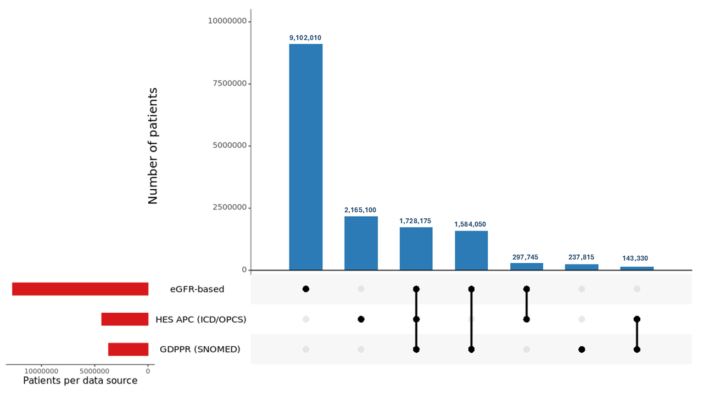
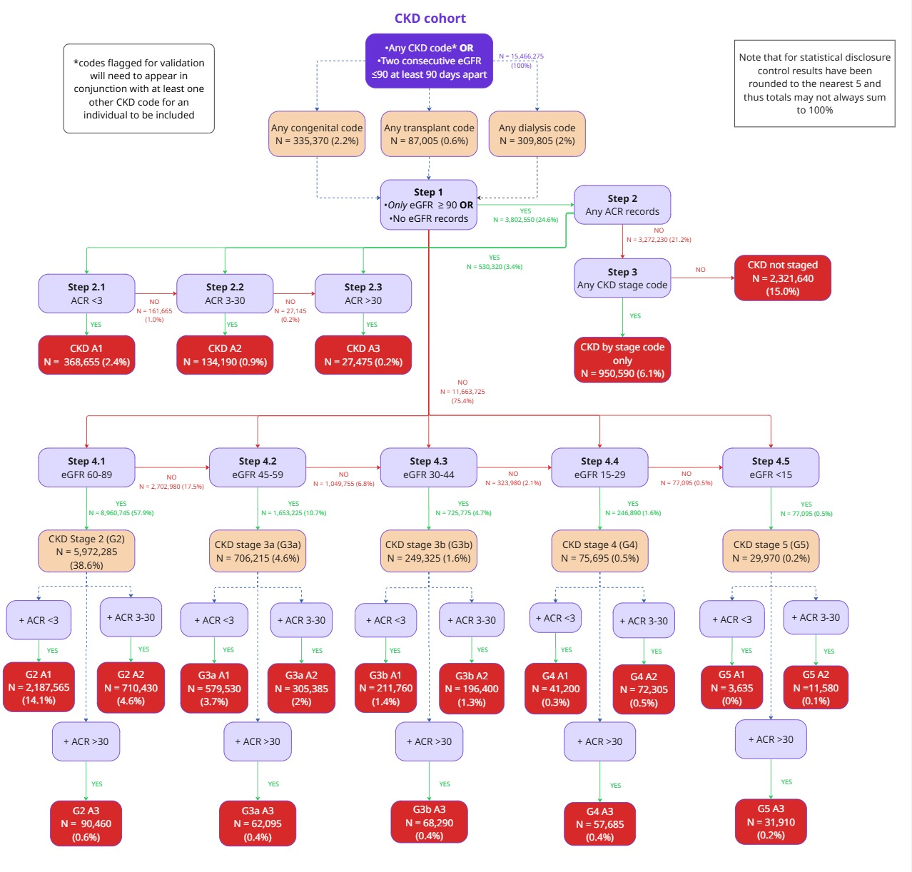
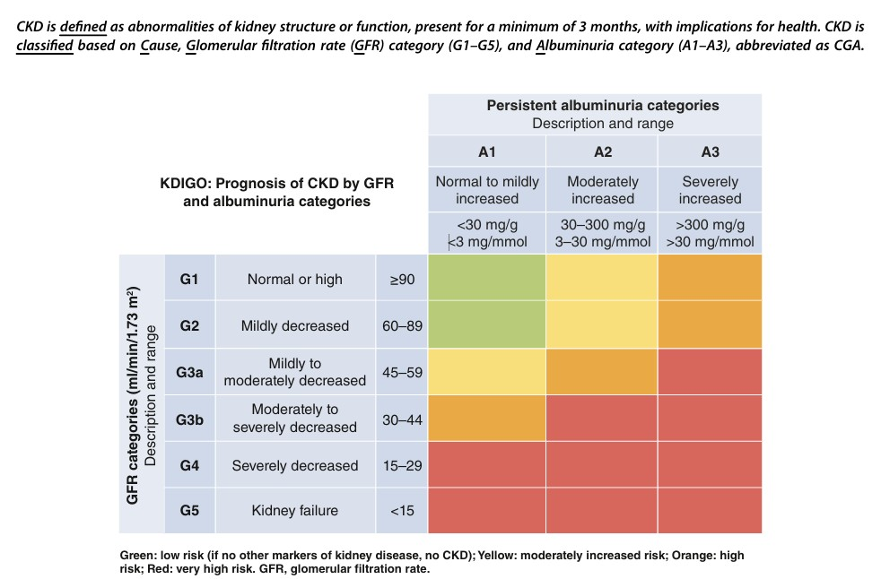

# Chronic Kidney Disease Algorithm

**Author:** Anna Stevenson (BHF Data Science Centre) wrote the code for the original CKD algorithm.
Chunks of code for the CKD algorithm have been adapted from Fionna Chalmers' code for the diabetes algorithm.
The code was further updated by Jadene Lewis.
This document was compiled by Jadene Lewis and Laura Sherlock.

---

## Table of Contents
1. [Introduction](#introduction)
2. [Glossary](#glossary)
3. [Data Sources and Concept Mapping](#data-sources-and-concept-mapping)
4. [Cohort Definition](#cohort-definition)
5. [Algorithm Flowchart](#algorithm-flowchart)
6. [Code Lists and Phenotyping Resources](#code-lists-and-phenotyping-resources)
7. [Algorithm Versions](#algorithm-versions)
8. [Implementation in GitLab and Databricks](#implementation-in-gitlab-and-databricks)
9. [Algorithm Output Tables](#algorithm-output-tables)
10. [Use within SAIL / R Environment](#use-within-sail--r-environment)

---

## Introduction

This document describes a reproducible algorithm for identifying and staging chronic kidney disease (CKD) using routinely collected electronic health record (EHR) data within the Secure Data Environment (SDE).
The algorithm was developed by a multidisciplinary working group to translate established clinical definitions of CKD into operational definitions that can be consistently applied to large-scale health datasets.

The BHF Data Science Centre Kidney Catalyst Chronic Kidney Disease (CKD) phenotyping exercise aimed to develop robust, transparent, and clinically meaningful definitions of CKD that could be applied across large-scale health data resources. This work recognised the complexity and heterogeneity of CKD, as well as the challenges associated with identifying patients consistently using routinely collected data.

A key strength of the phenotyping exercise was its iterative, consensus-driven approach. Rather than relying solely on predefined definitions, the process brought together a multidisciplinary group of stakeholders to co-develop and refine phenotyping strategies. Participants included data scientists, epidemiologists, clinicians from relevant specialties, and patient representatives, ensuring that both technical and lived-experience perspectives were incorporated.

The consensus-building process was supported through two structured online workshops. These workshops enabled participants to discuss proposed phenotype definitions, highlight practical challenges (such as data availability, coding variability, and clinical nuance), and suggest refinements. Between workshops, feedback was synthesised and used to iteratively improve the phenotyping approach, allowing the group to converge on definitions that balanced scientific rigour with real-world applicability.

Overall, the CKD phenotyping exercise within the Kidney Catalyst programme exemplifies a collaborative and transparent methodology for developing data-driven health research tools. The iterative consensus approach not only strengthened the validity of the phenotypes but also enhanced their acceptability and potential for widespread adoption across the research community.

## Glossary

To place the work presented in this document in context the below table explains some of the key terms.

| Term | Definition | Notes |
|---|---|---|
| ACR | Albumin-to-Creatinine Ratio | A laboratory measure used to assess the amount of albumin in urine, adjusted for creatinine. It is used to detect and quantify kidney damage and is important for CKD staging and risk stratification. |
| Creatinine | A waste product generated from muscle metabolism, measured in blood or urine | Commonly used as a marker of kidney function. Blood creatinine levels are used to calculate eGFR. |
| EHR | Electronic Health Record | A digital version of a patient's medical history containing information such as diagnoses, medications, laboratory results, procedures, and healthcare encounters across care settings. |
| GDPPR | General Practice Extraction Service Data for Pandemic Planning and Research | A national primary care dataset in England containing coded clinical information from GP records, including diagnoses, medications, and laboratory results. |
| HES-APC | Hospital Episode Statistics – Admitted Patient Care | National administrative dataset of all inpatient hospital admissions in England. Includes diagnostic and procedural coding for each admission. |
| ICD-10 codes | International Classification of Diseases, 10th Revision | Standardised coding system for diagnoses. Used internationally; in this context, codes are used to identify conditions such as chronic kidney disease and related comorbidities. |
| IMD | Index of Multiple Deprivation | A composite measure of relative deprivation at small area level in England, based on domains such as income, employment, education, health, crime, housing, and environment. Often linked via LSOA to provide socioeconomic context. |
| LSOA | Lower Layer Super Output Area | A unique identifier for a small geographic area in England or Wales, designed to contain a population of between 1,000 and 3,000 residents. |
| OPCS code | Office of Population Censuses and Surveys Classification of Interventions and Procedures | Standardised coding system for procedures performed during an inpatient stay. Used within HES data to capture surgical and interventional activity. |
| SDE | Secure Data Environment | A controlled computing environment designed to enable secure access, storage, and analysis of sensitive data such as healthcare records while protecting patient confidentiality and privacy. |
| SNOMED codes | Systematized Nomenclature of Medicine Clinical Terms (SNOMED CT) | A comprehensive, hierarchical clinical coding system used in primary care to record diagnoses, symptoms, and procedures with greater granularity than ICD-10. |
| eGFR | Estimated Glomerular Filtration Rate | A calculated measure of kidney function derived from serum creatinine, age, sex, and sometimes ethnicity. Used to diagnose and stage chronic kidney disease. |
| person_id | A pseudonymised patient-level identifier used to link records for the same individual across datasets | Not directly identifiable; enables longitudinal analysis across multiple healthcare data sources. |

## Data Sources and Concept Mapping

The algorithm integrates multiple national healthcare datasets:

- Primary care: GDPPR
- Secondary care: HES-APC (diagnosis and procedures)
- Demographics data

Clinical definitions are translated into data representations as shown below.

| Clinical Concept | Data Representation | Data Source |
|---|---|---|
| CKD diagnosis | ICD10/SNOMED diagnosis codes | HES-APC diagnosis / GDPPR |
| Kidney function | eGFR (derived from creatinine lab results) | GDPPR |
| Kidney damage | ACR lab results | GDPPR |
| End-stage disease | OPCS/SNOMED dialysis or transplant codes | HES-APC procedure/GDPPR |

- eGFR is derived from serum creatinine using the [CKD-EPI 2021 equation](https://www.kidney.org/ckd-epi-creatinine-equation-2021-0) (sex- and age-adjusted)
- CKD diagnosis date is defined as:
  - The second eGFR ≤ 90 (≥90 days after first), or
  - The earliest CKD diagnosis/procedure code in GDPPR or HES

## Cohort Definition

The first step of the algorithm identifies individuals with any evidence of CKD.

### Inclusion criteria include:

- Presence of CKD diagnostic codes in primary care (SNOMED diagnostic codes in GDPPR)
- Presence of CKD diagnostic codes in secondary care (ICD10 codes in HES APC)
- Evidence of kidney related procedure (e.g. dialysis or transplant) in primary care (SNOMED procedural codes in GDPPR)
- Evidence of kidney related procedure (e.g. dialysis or transplant) in secondary care (OPCS codes in HES APC)
- Laboratory evidence obtained from primary care records (SNOMED code plus measurement value in GDPPR):
  - ≥2 reduced eGFR measurements (derived from creatinine values from GDPPR)
  - Measurements must be at least 90 days apart

### Upset plot of data sources

The below plot highlights the overlap between patients who have evidence of CKD from secondary care (diagnosis or procedure codes), primary care, and lab-derived measures (eGFR).
Note that counts have been rounded to the nearest 5, and values under 10 redacted, as per NHS SDE guidelines.



## Algorithm Flowchart

Decision tree illustrating the logic of the algorithm illustrated below.
Note that counts have been rounded to the nearest 5, and values under 10 redacted, as per NHS SDE guidelines.



### Key steps:

1. Identify CKD cases from across the data sources
2. Confirm chronicity where required
3. Assign CKD stage based on available data
4. Handle missing or incomplete data

### CKD Staging

**G (eGFR) staging**
- Based on kidney function
- Lower eGFR → more severe disease
- Classified using the [KDIGO guidelines](https://www.kidney-international.org/article/S0085-2538(23)00766-4/fulltext)

**A (ACR) staging**
- Based on albuminuria
- Higher ACR → more severe kidney damage
- Classified using the [KDIGO guidelines](https://www.kidney-international.org/article/S0085-2538(23)00766-4/fulltext)

The below table illustrates the staging nomenclature advocated by the KDIGO:



### Handling incomplete data

The algorithm includes logic to maximise valid case identification:

- If eGFR available → use for G staging (G2–G5)
- If ACR available → assign albuminuria stage (A1–A3)
- If only diagnostic codes available → use coded stage where possible
- If dialysis/transplant present → classify as advanced CKD
- If insufficient data → classify as "CKD, not staged"

## Code Lists and Phenotyping Resources

The algorithm uses ~550 clinical codes compiled from the HDR UK Phenotype Library and related projects.
Codelists have been uploaded to the HDR UK Phenotype Library:

- CKD (all codes) available here ([PH4035](https://phenotypes.healthdatagateway.org/phenotypes/PH4035/version/9272/detail/))
- Dialysis available here ([PH4036](https://phenotypes.healthdatagateway.org/phenotypes/PH4036/version/9238/detail/))
- Transplant available here ([PH4037](https://phenotypes.healthdatagateway.org/phenotypes/PH4037/version/9239/detail/))
- Congenital kidney disease available here ([PH4038](https://phenotypes.healthdatagateway.org/phenotypes/PH4038/version/9240/detail/))

## Algorithm Versions

Explanation of Algorithm Versions (v1, v2, v2.1)

The algorithm exists in two main versions (**v1** and **v2**) and one patched version (**v2.1**).

**Version 1 (v1)** is the original implementation of the CKD cohort-building and staging pipeline. It contains the initial logic for identifying the CKD cohort and applying the staging algorithm to each individual, using the original CKD codelists and eGFR grouping rules. This version serves as the baseline reference for all subsequent updates.

**Version 2 (v2)** retains the full logic of v1 but introduces two key updates. First, the codebase was reformatted and refactored to resolve errors that emerged during the migration to Unity Catalog in Databricks—these were structural rather than conceptual changes.

Second, v2 incorporates the **N18.0 (End-stage renal disease)** ICD-10 code into the CKD ICD-10 codelist and captures it within **Stage 5**. This addition ensures consistency with other KDSC projects, which already included N18.0 in their CKD definitions.

Historically, N18.0 appeared in the 2008 4th Edition of ICD-10 but was removed in the 2010 5th Edition, when the N18 category was expanded and the *end-stage renal disease* concept was absorbed into **N18.5 (Stage 5)** and relevant status codes such as **Z99.2 (Dependence on renal dialysis)** and **Z94.0 (Kidney transplant status)**.

HES APC data in the NHS England SDE shows N18.0 in active use until FY 2012/13, aligning with the implementation of the updated ICD-10 classification. This mirrors the historical transition from **N03 (Chronic nephritic syndrome)** to the **N18.1–N18.5** codes. Given that N03 is already included in the CKD codelist, adding N18.0 ensures completeness across the full historical period and avoids under-ascertainment of Stage 5 CKD prior to 2012.

Including N18.0 therefore increases capture of earlier ESRD cases and may shift staging outputs for individuals coded before the ICD-10 update.

**Version 2.1 (v2.1)** is a targeted patch addressing a specific issue in the `eGFR_creat` grouping logic. The original logic used integer-based group boundaries (e.g., 90–59, 59–45, etc.), but the CKD-EPI formula naturally produces non-integer eGFR values such as 89.3, 59.7, or 44.2.

These values did not match any of the integer-based group definitions and therefore fell into `.otherwise(None)`, resulting in missing eGFR categories for valid observations.

Instead of redefining the interval boundaries, v2.1 resolves this by rounding all `eGFR_creat` values to the nearest integer before grouping, ensuring that every valid measurement is captured in a non-null category. This preserves the original grouping structure while eliminating gaps caused by decimal values.

No other logic changes were made in this patch.

## Implementation in GitLab and Databricks

To ensure reproducibility and project-specific control, each version of the CKD algorithm should be implemented through a dedicated GitLab branch and executed via a Databricks workflow inside the NHS England SDE. This mirrors the established pattern used for other phenotyping pipelines (e.g., diabetes) and ensures that each project runs against a stable, version-locked implementation.

### Preparing the Algorithm in GitLab

- In GitLab, navigate to the `hds_phenotypes_ckd` repository under the `dsa-391419-j3w9t` group.
- Create a new branch with a clear, project-specific name (e.g., `ccu000_00`). Ensure the branch is created from the `release_4` tag.
- **Optional but strongly recommended:** Update the cohort parameter values in the job parameters notebook (`0.parameters/kdsc-parameters.py`) and commit these changes to your branch.
  - This creates a persistent, auditable record of the parameters used to generate your cohort.
  - Otherwise, the only record exists in the workflow run metadata, which may later be removed.

### Configuring the Workflow in Databricks

- In the SDE Databricks workspace, go to **Jobs & Pipelines** and select the workflow corresponding to the CKD algorithm (**CKD Algorithm – hds_phenotypes_ckd**).
- In the right-hand panel, open **Git settings** (*Edit Git settings*).
  - Update the Git reference to the branch you created (e.g., `ccu000_00`).
  - Do not modify the Git repository or Git provider fields.
- Next, open **Job Parameters** (*Edit parameters*).
  - Configure these according to your project needs (see parameter definitions below).
- Select **Run Now** to execute the workflow.
  - This triggers all notebooks in the DAG to generate a population-wide CKD cohort using your project-specific parameters.
- The resulting cohort and derived tables will be saved in the `dsa_391419_j3w9t` database, prefixed with your project name.

### Algorithm Parameters (CKD Algorithm)

These parameters control how the algorithm is executed and should be tailored to your project.

#### Core Parameters

- **algorithm_version** — Version of the CKD algorithm to use. Options: `V2.0`, `V2.1`. Default: `V2.1`.

- **individual_censor_dates_flag** — `True` if your project uses a table of individual censor dates; otherwise `False`. When `True`, CKD status is assessed at each person's censor date rather than the study end date. Default: `False`.

- **individual_censor_dates_table** — Required when `individual_censor_dates_flag = True`. Provide the full table name, for example:

  ```text
  dsa_391419_j3w9t_collab.my_censor_table
  ```

  Must contain `PERSON_ID` and `CENSOR_END`.

- **last_observable_flag** — Controls how `last_observable_date` is derived.
  - `False`: set to `pipeline_production_date`.
  - `True`: algorithm determines the most recent date where all data sources are complete, ensuring no data lag. Death dates override if earlier.

  Default: `True`.

- **pipeline_production_date** — Required. Sets the archived snapshot date for GDPPR, HES APC, PMEDS and Deaths. Must be after `2020-12-11`. Use today's date for the most recent snapshot.

- **proj** — Project name prefix for all output tables. Required.

- **study_end_date** — Used when individual censor dates are not provided. Defines the date at which CKD status is assessed.

- **study_start_date** — Earliest date to include records from. Default: `1900-01-01`.

## Algorithm Output Tables

All outputs are saved using the format:

```text
{proj}_kdsc_{algorithm_version}_{table_name}_{algorithm_timestamp}
```

where:

```text
algorithm_timestamp = pipeline_production_date (YYYY_MM_DD)
```

Output tables include:

- **parameters_df_datasets** — Logs source datasets and `archived_on` versions.
- **parameters_df_last_observable_date** — Logs last observable dates per dataset.
- **cohort** — All derived variables used in the CKD algorithm.
- **cohort_out** — Step-wise results and final CKD classification.

## Use within SAIL / R Environment

Future development includes an R-based implementation for use in SAIL Databank.
